<p align="center">
  <a href="https://codely.com">
    
  </a>
</p>

<h1 align="center">
  🪆 Codely Figma Plugin Skeleton
</h1>

<p align="center">
    <a href="https://github.com/CodelyTV/figma-plugin-skeleton/actions/workflows/ci.yml"></a>
    <a href="https://github.com/CodelyTV"></a>
    <a href="https://pro.codely.com"></a>
</p>

<p align="center">
  Template intended to serve as a starting point if you want to <strong>bootstrap a Figma Plugin in TypeScript</strong>.
  <br />
  <br />
  Take a look, play and have fun with this.
  <a href="https://github.com/CodelyTV/figma-plugin-skeleton/stargazers">Stars are welcome 😊</a>
</p>

The purpose of this repository is to leave it with the bare minimum dependencies and tools needed to build Figma Plugins but **based on software development best practices such as SOLID principles, testing, and tooling already configured** 🤟

## 🚀 Running the app

- Install the dependencies: `npm install`
- Execute the tests: `npm run test`
- Check linter errors: `npm run lint`
- Fix linter errors: `npm run lint:fix`
- Make a build unifying everything in the same `dist/figmaEntrypoint.js` file: `npm run build`
- Run a watcher on your plugin files and make the build on every change: `npm run dev`

## 🗺️ Steps to develop your own plugin

1. Click on the "Use this template" button in order to create your own repository based on this one
2. Clone your repository
3. Replace the skeleton branding by your own:
   - Modify the `name` property of your [`manifest.json`](manifest.json) file, and set the `id` value following the next steps in order to obtain it from Figma:
     1. Generate a plugin in the Figma App: `Figma menu` > `Plugins` > `Development` > `New Plugin…`
     2. Download the Figma plugin files
     3. Open the downloaded `manifest.json` and copy the `id` property value
   - Modify the following [`package.json`](package.json) properties: `name`, `description`, `repository.url`, `bugs.url`, and `homepage`
4. Install your plugin in your Figma App: `Figma menu` > `Plugins` > `Development` > `Import plugin from manifest…`
5. Develop in a continuos feedback loop with the watcher: `npm run dev`

ℹ️ And remember to star this repository in order to promote the work behind it 🌟😊

## 🏗️ Software Architecture

### 📍 Figma entrypoint

You will find the entrypoint that Figma will execute once the plugin is executed in the [`src/figma-entrypoint.ts`](src/figma-entrypoint.ts) file, which is intended to represent the interaction with the Figma UI, leaving the logic of your plugin to the different commands that will be executed in the Browser or in the Figma Scene Sandbox.

### 🎨 UI

In the [`src/ui`](src/ui) folder you will find the HTML, CSS, and TS files corresponding to the plugin user interface. We have decided to split them up in order to allow better code modularization, and leaving Webpack to transpile the TypeScript code into JavaScript and inline it into the HTML due to Figma restrictions 😊

### ⚡ Commands

Commands are the different actions an end user can perform from the plugin UI. In the [`src/ui/ui.ts`](src/ui/ui.ts) you will see that we are adding event listeners to the plugin UI in order to execute these Commands such as the following one:

```typescript
import { executeCommand } from "./commands-setup/executeCommand";

document.addEventListener("click", function(event: MouseEvent) {
  const target = event.target as HTMLElement;

  switch (target.id) {
    case "cancel":
      executeCommand(new CancelCommand());
      break;
    // […]
  }
});
```

This `executeCommand(new CancelCommand());` function call is needed due to how Figma Plugins run, that is, communicating ourselves between the following types of elements:


1. The [`src/figma-entrypoint.ts`](src/figma-entrypoint.ts): As described before, in general this is the file that Figma will execute once the user runs your plugin. However, there are multiple scenarios depending on the type of plugin:
   - **Plugins with a single use case**:

     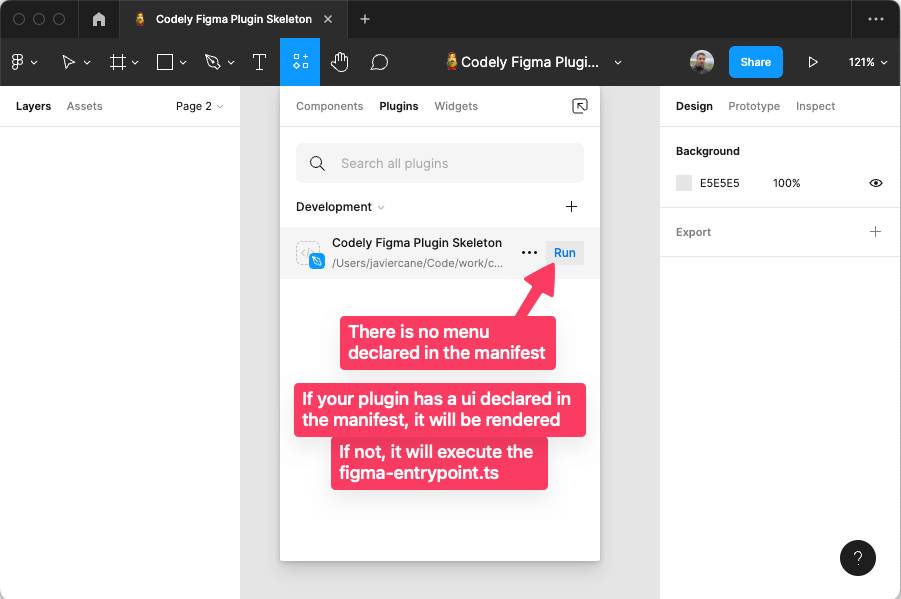
     - **Plugins with UI**: If you do not have a `"menu"` key declared in the [`manifest.json`](manifest.json), but a `"ui"` one, Figma will render the [`src/ui/ui.html`](src/ui/ui.html) which is bundled together with the [`src/ui/ui.ts`](src/ui/ui.ts) and [`src/ui/ui.css`](src/ui/ui.css). That UI will run inside the Figma Browser iframe, and you will be able to execute Commands as in the previous example, that is, using the `executeCommand` method from the `ui.ts`. These commands will arribe to this `figma-entrypoint.ts` in order to be executed. You have an example for the "Cancel" button of the plugin UI mentioned before: [`CancelCommand`](src/scene-commands/cancel/CancelCommand.ts) mapped in the [`CommandsMapping`](src/commands-setup/CommandsMapping.ts#L12) to the [`CancelCommandHandler`](src/scene-commands/cancel/CancelCommandHandler.ts) and tested out in the [`CancelCommandHandler.test`](tests/scene-commands/CancelCommandHandler.test.ts).
     - **Plugins without UI**: If you do not have either a `"menu"` key declared in the [`manifest.json`](manifest.json), nor a `"ui"` one, Figma will render the [`src/figma-entrypoint.ts`](src/figma-entrypoint.ts) and you will be able to execute Commands directly from there with the `handleCommand` method. These commands will arribe to this `figma-entrypoint.ts` in order to be executed.
   - **Plugins with multiple use cases**:

     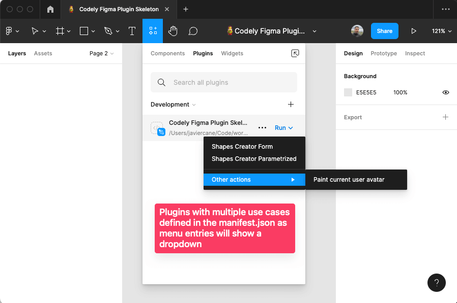

     You can define several use cases will be defined as `menu` items declared in the [`manifest.json`](manifest.json). In this case, this entrypoint will directly execute the Command Handler mapped in the [`src/commands-setup/CommandsMapping.ts`](src/commands-setup/CommandsMapping.ts) that corresponds to the `menu.[].command` key. You have an example for instance for the `createShapes` Command which is mapped to the [`src/scene-commands/create-shapes/CreateShapesCommandHandler.ts`](src/scene-commands/create-shapes/CreateShapesCommandHandler.ts).
     One of this use cases can actually be to show the UI. You can see it [declared with the `showUi` command name](manifest.json#L13) and [handled as a particular case](src/figma-entrypoint.ts#L11).
2. The Browser iframe Figma creates for us in order to run the plugin UI. This iframe is needed in order to gain access to the browser APIs in order to perform HTTP requests for instance.
3. The Figma scene exposed in order to create elements or access to the different layers from the [`src/scene-commands`](src/scene-commands) which runs inside the Figma sandbox.
4. The previous commands could need some information from the external world, so they must send out a command to be handled inside the iframe. You can see an example of this in the [`PaintCurrentUserAvatarCommandHandler`](src/scene-commands/paint-current-user-avatar/PaintCurrentUserAvatarCommandHandler.ts). All you have to do to perform the request is executing a `NetworkRequestCommand`:
   ```typescript
   executeCommand(
     new NetworkRequestCommand("https://example.com/some/api/endpoint", "text")
   );
   ```
   And listen for the response:
   ```typescript
   return new Promise((resolve) => {
     this.figma.ui.onmessage = async (message) => {
       await this.doThingsWith(message.payload);
       resolve();
     };
   });
   ```

#### 🆕 How to add new commands

If you want to add new capabilities to your plugin, we have intended to allow you to do so without having to worry about all the TypeScript stuff behind the Commands concept. It is as simple as:

1. Create a folder giving a name to your Command. Example: [`src/scene-commands/cancel`](src/scene-commands/cancel)
2. Create the class that will represent your Command.
   - Example of the simplest Command you can think of (only provides semantics): [`src/scene-commands/cancel/CancelCommand.ts`](src/scene-commands/cancel/CancelCommand.ts)
   - Example of a Command needing parameters: [`src/scene-commands/create-shapes/CreateShapesCommand.ts`](src/scene-commands/create-shapes/CreateShapesCommand.ts)
3. Create the CommandHandler that will receive your Command and will represent the business logic behind it. Following the previous examples:
   - [`src/scene-commands/cancel/CancelCommandHandler.ts`](src/scene-commands/cancel/CancelCommandHandler.ts)
   - [`src/scene-commands/create-shapes/CreateShapesCommandHandler.ts`](src/scene-commands/create-shapes/CreateShapesCommandHandler.ts)
4. Link your Command to your CommandHandler adding it to the [`src/commands-setup/CommandsMapping.ts`](src/commands-setup/CommandsMapping.ts)
5. Send the command from [`src/ui/ui.ts`](src/ui/ui.ts) as shown previously: `executeCommand(new CancelCommand());`

## 🌈 Features

### ✨ Illustrative working examples

In order to show the potential Figma Plugins have, we have developed several use cases:

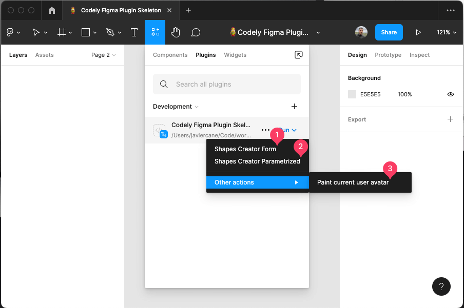

#### 👀 Shapes Creator Form

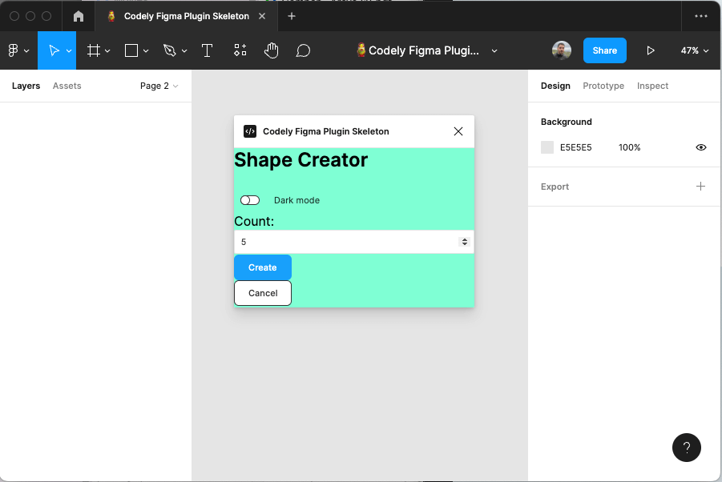
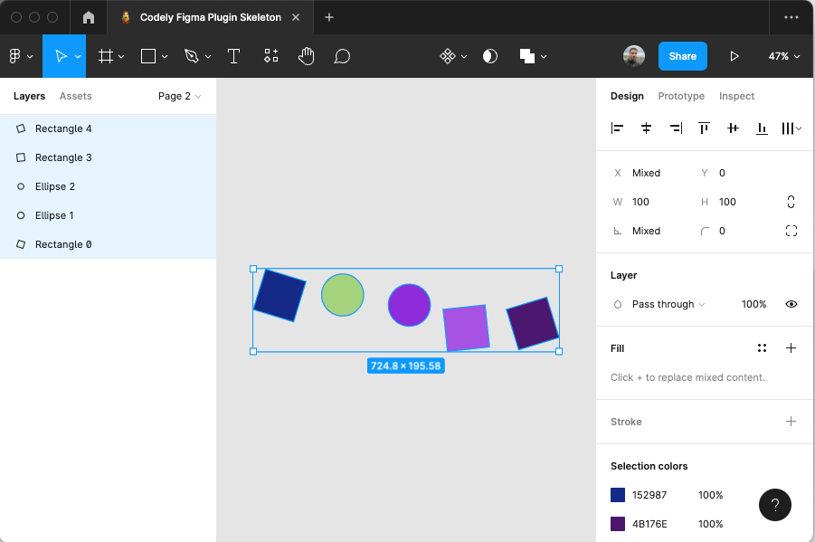

Demonstrative purposes:

- Render a UI allowing it to be modular and scalable (Webpack bundling working in Figma thanks to JS inline)
- How to communicate from the Figma Browser iframe where the UI lives to the Figma Scene Sandbox in order to execute commands like the `createShapes` one which require to modify the viewport, create and select objects, and so on
- Work with the Figma Plugins API randomizing multiple variables to make it a little more playful:
  - The shapes to create (rectangles and ellipses)
  - The rotation of each shape
  - The color of the shapes

####  ⌨️ Shapes Creator Parametrized

You can launch parametrized menu commands from the Figma Quick Actions search bar:

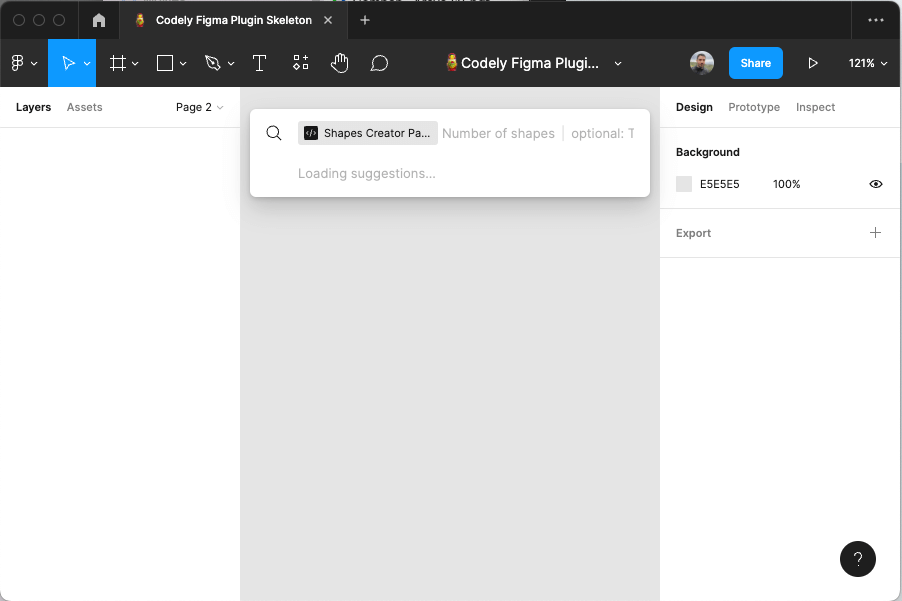

It even allows you to configure optional parameters and suggestions for them:

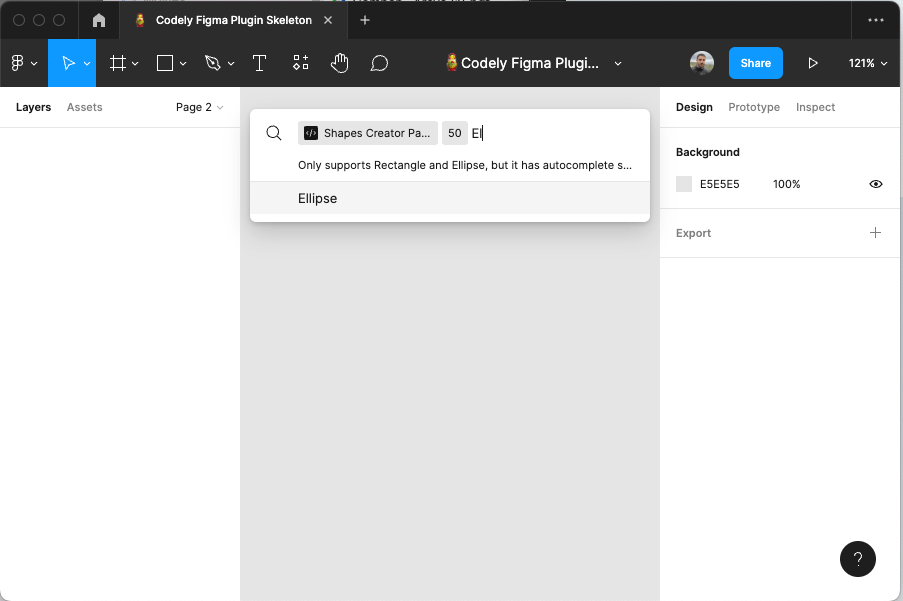

Demonstrative purposes:

- Take advantage of the Parametrized Figma Plugins in order to offer a simple UI integrated with the Figma ecosystem without having to implement any HTML or CSS
- Reuse the very same use case ([`CreateShapesCommandHandler`](src/scene-commands/create-shapes/CreateShapesCommandHandler.ts)) from multiple entry-points. That, is we are using that very same business logic class:
  - Calling it [from the `ui.ts`](src/ui/ui.ts#L23) once the user clicks on the `create` button because we are executing the command with `executeCommand(new CreateShapesCommand(count));`
  - Configuring [the parametrized menu entry in the `manifest.json`](manifest.json#L14) with the very same `command` name [as mapped in the `CommandsMapping`](src/commands-setup/CommandsMapping.ts#L13), and the same parameters `key` as defined in [the command constructor](src/scene-commands/create-shapes/CreateShapesCommand.ts#L12)
- Configure optional parameters and how they map to nullable TypeScript arguments
- Specify suggestions for some parameter values that can be programmatically set. Example in [the `figma-entrypoint`](src/figma-entrypoint.ts#L28) for the `typeOfShapes` parameter.

####  🎨 Paint current user avatar

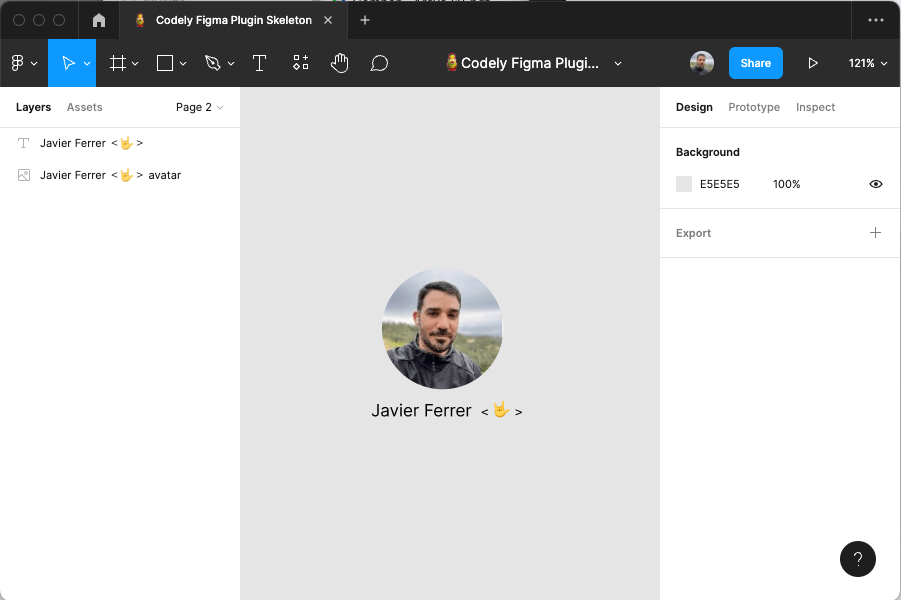

Demonstrative purposes:

- Communicate back from the Figma Scene Sandbox to the Figma Browser iframe in order to perform the HTTP request in order to get the actual user avatar image based on its URL due to not having access to browser APIs inside the `src/scene-commands` world
- Define the architecture in order to have that HTTP request response handler defined in a cohesive way inside the actual use case which fires it. Example in the [`PaintCurrentUserAvatarCommandHandler`](src/scene-commands/paint-current-user-avatar/PaintCurrentUserAvatarCommandHandler.ts#L29).
- Paint an image inside the Figma scene based on its binary information
- Declare a more complex menu structure containing separators and sub-menu items
- Loading the text font needed in order to create a text layer and position it relative to the image size

### 🫵 Simplified communication

If you take a look at the official documentation on [how Figma Plugins run](https://www.figma.com/plugin-docs/how-plugins-run/), you will see that there is a `postMessage` function in order to communicate between the two Figma Plugin worlds previously described:

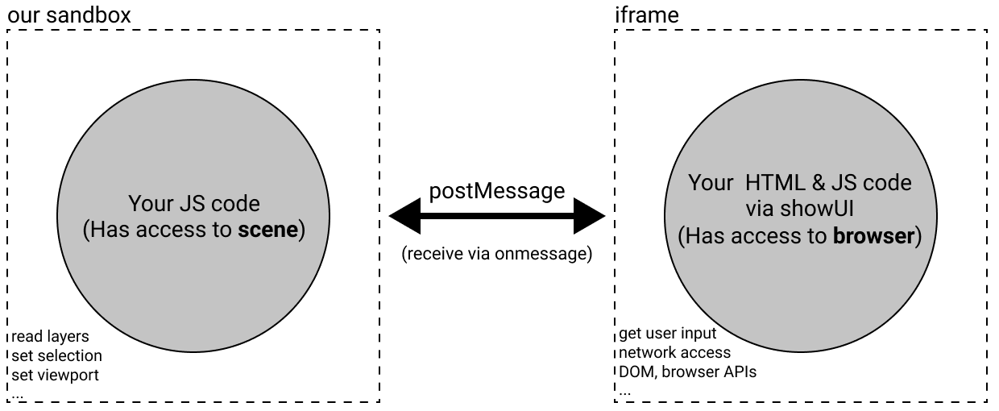

However, that `postMessage` function is different depending on where you are executing it:

- From the Figma Scene sandbox to the UI iframe: `figma.ui.postMessage(message)`
- From the UI iframe to the Figma Scene sandbox: `window.parent.postMessage({ pluginMessage: command }, "*")`

We have simplified this with an abstraction that also provides semantics and type constraints making it easier to use. You only have to use [the `executeCommand` function](src/commands-setup/executeCommand.ts) without worrying about anything else:

```typescript
import { executeCommand } from "./commands-setup/executeCommand";

executeCommand(new CancelCommand());
```

This is why you will see it on the Codely Figma Plugin Architecture diagram while communicating on both ways:


### ✅ Software development best practices

Focus of all the decisions made in the development of this skeleton: Let you, the developer of the plugin that end users will install, **focus on implementing your actual use cases** instead of all the surrounding boilerplate ⚡

We have followed an approach for developing this Codely Figma Plugin Skeleton based on the SOLID Software Principles, specially the Open/Closed Principle in order to make it easy for you to **extend the capabilities of your plugin with just adding little pieces of code** in a very structured way 😊

### ✨ Developer and end user experience

This skeleton already provides a friendly way to handle error produced by the plugins built with it.

If your plugin makes use of the `executeCommand` method in order to execute commands, we already have you covered in case you have not registered them yet. It would be visible in the actual Figma interface, and specify all the details in the JavaScript console, ¡even suggesting a fix! 🌈:

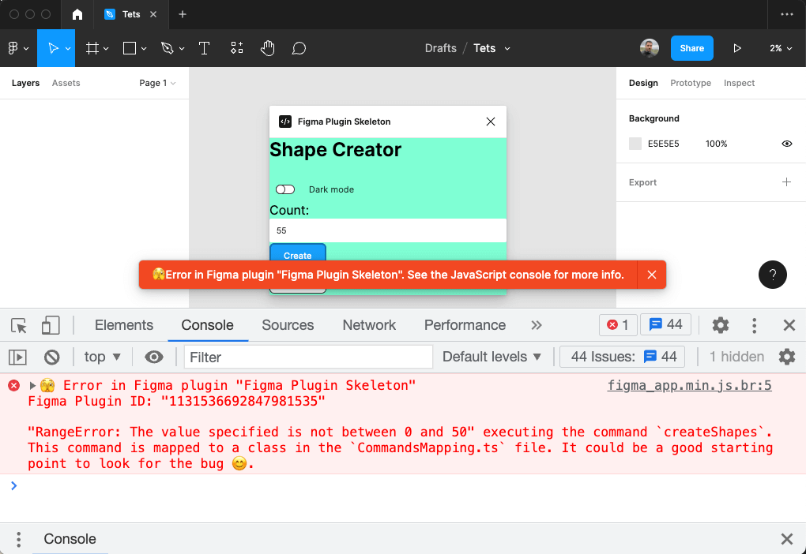

In case you already registered your command, but it throws an unhandled by you error for whatever reason, we propagate it to the end user in a very friendly way 😇:

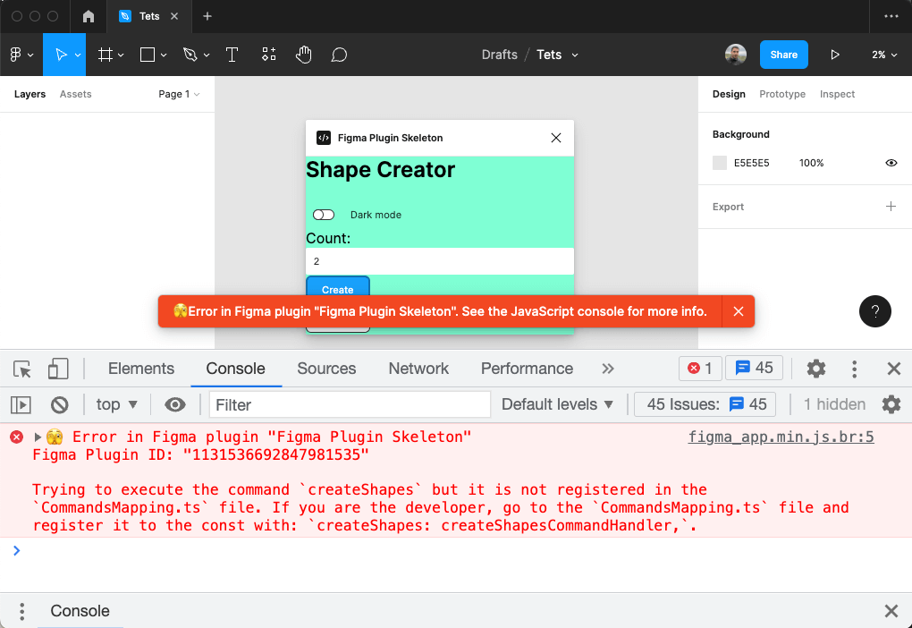

### 🧰 Tooling already configured

- [TypeScript](https://typescriptlang.org) (v4)
- [Prettier](https://prettier.io)
- [Webpack](https://webpack.js.org)
- [ESLint](https://eslint.org) with:
  - [Simple Import Sort](https://github.com/lydell/eslint-plugin-simple-import-sort)
  - [Import plugin](https://github.com/benmosher/eslint-plugin-import)
  - And a few other ES2015+ related rules
- [Jest](https://jestjs.io) with [DOM Testing Library](https://testing-library.com/docs/dom-testing-library/intro)
- [GitHub Action workflows](https://github.com/CodelyTV/figma-plugin-skeleton/actions) set up to run tests and linting on push
- [SWC](https://swc.rs): Execute your tests in less than 200ms

### 🤏 Decisions made to promote code quality and structure consistency

- Specify proper dependencies version restriction (no wild wildcards `*`)
- Encapsulate all the transpiled code into the `dist` folder
- Encapsulate all the Plugin source code into the `src` folder
- Configure TypeScript through the `tsconfig.json` in order to promote safety and robust contracts (no more `any` paradise)
- Add code style checker with Prettier and ESLint
- Add test suite runner with Jest
- Add Continuous Integration Workflow with GitHub Actions

### 🧽 Remove unnecessary code

Depending on your plugin type you will find unnecessary code in this template. However, here you have the instructions on how to delete it with a few commands 😊

#### 🙈 Plugins with just a use case (no menu actions or UI)

- [`manifest.json`](manifest.json): Remove the `ui` property
- Remove the following folder: `rm -rf src/ui`
- Modify the [`src/figma-entrypoint.ts`](src/figma-entrypoint.ts) directly executing the command you want to perform as a single use case with `handleCommand({ type: "yourCommandTypeIdentifier" });`

#### 🖌️ Plugins without FigJam support 

- [`manifest.json`](manifest.json): Remove the `figjam` value from the `editorType` property, leaving the property as an array but only containing the `figma` value

#### 🧊 Plugins without tests

- Remove the `✅ Run tests` step from [the Continuous Integration pipeline](.github/workflows/ci.yml)
- `rm -rf tests`
- `rm -rf jest.config.js`
- `npm uninstall -D jest`
- Remove the `scripts.test` property from the [`package.json`](package.json)

## 👀 Inspiration

Other Figma plugins repositories where we found inspiration to create this one:

- [figma-plugin-typescript-boilerplate](https://github.com/aarongarciah/figma-plugin-typescript-boilerplate)
- [Create Figma Plugin](https://yuanqing.github.io/create-figma-plugin/)

## 👌 Codely Code Quality Standards

Publishing this package we are committing ourselves to the following code quality standards:

- 🤝 Respect **Semantic Versioning**: No breaking changes in patch or minor versions
- 🤏 No surprises in transitive dependencies: Use the **bare minimum dependencies** needed to meet the purpose
- 🎯 **One specific purpose** to meet without having to carry a bunch of unnecessary other utilities
- ✅ **Tests** as documentation and usage examples
- 📖 **Well documented ReadMe** showing how to install and use
- ⚖️ **License favoring Open Source** and collaboration

## 🔀 Related skeleton templates

Opinionated TypeScript skeletons ready for different purposes:

- [🔷🌱 TypeScript Basic Skeleton](https://github.com/CodelyTV/typescript-basic-skeleton)
- [🔷🕸️ TypeScript Web Skeleton](https://github.com/CodelyTV/typescript-web-skeleton)
- [🔷🌍 TypeScript API Skeleton](https://github.com/CodelyTV/typescript-api-skeleton)
- [🔷✨ TypeScript DDD Skeleton](https://github.com/CodelyTV/typescript-ddd-skeleton)

This very same basic skeleton philosophy implemented in other programming languages:

- [✨ JavaScript Basic Skeleton](https://github.com/CodelyTV/javascript-basic-skeleton)
- [☕ Java Basic Skeleton](https://github.com/CodelyTV/java-basic-skeleton)
- [📍 Kotlin Basic Skeleton](https://github.com/CodelyTV/kotlin-basic-skeleton)
- [🧬 Scala Basic Skeleton](https://github.com/CodelyTV/scala-basic-skeleton)
- [🦈 C# Basic Skeleton](https://github.com/CodelyTV/csharp-basic-skeleton)
- [🐘 PHP Basic Skeleton](https://github.com/CodelyTV/php-basic-skeleton)
