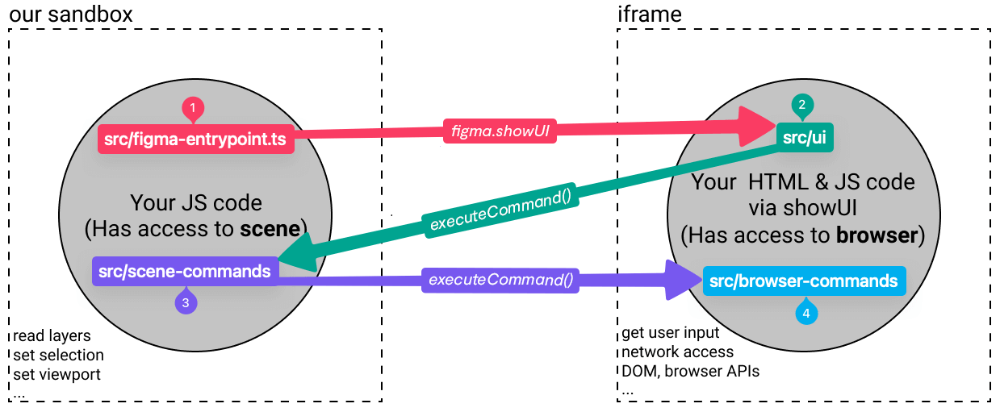

<p align="center">
  <a href="https://codely.com">
    
  </a>
</p>

<h1 align="center">
  🪆 Codely Figma Plugin Skeleton
</h1>

<p align="center">
    <a href="https://github.com/CodelyTV"></a>
    <a href="https://pro.codely.com"></a>
</p>

<p align="center">
  Template intended to serve as a starting point if you want to <strong>bootstrap a Figma Plugin in TypeScript</strong>.
  <br />
  <br />
  Take a look, play and have fun with this.
  <a href="https://github.com/CodelyTV/figma-plugin-skeleton/stargazers">Stars are welcome 😊</a>
</p>

The purpose of this repository is to leave it with the bare minimum dependencies and tools needed to build Figma Plugins but **based on software development best practices such as SOLID principles, testing, and tooling already configured** 🤟

## 🚀 Running the app

- Install the dependencies: `npm install`
- Execute the tests: `npm run test`
- Check linter errors: `npm run lint`
- Fix linter errors: `npm run lint:fix`
- Make a build unifying everything in the same `dist/main.js` file: `npm run build`
- Run a watcher on your plugin files and make the build on every change: `npm run dev`

## 🗺️ Steps to develop your own plugin

1. Click on "Use this template" in order to create your own repository based on this one
2. Clone your repository
3. Replace the skeleton branding by your own:
   - Modify the `name` property of your `manifest.json` file, and set the `id` one following the next steps in order to obtain it from Figma:
     1. Generate a plugin in the Figma App: `Figma menu` > `Plugins` > `Development` > `New Plugin…`
     2. Download the Figma plugin files
     3. Open the downloaded `manifest.json` and copy the `id` property value
   - Modify the following `package.json` properties: `name`, `description`, `repository.url`, `bugs.url`, and `homepage`
4. Remove unnecessary config depending on your plugin type:
   - If your plugin does not have a UI:
     - `manifest.json`: Remove the `ui` property
     - Remove `ui.html` file from the root of the repository
   - If your plugin is not intended to be used with FigJam: `manifest.json`: Remove the `figjam` value from the `editorType` property, leaving the property as an array but only containing the `figma` value
   - If you do not want to test your plugin:
     - `ci.yml`: Remove the `✅ Run tests` step 
     - Remove `tests` folder
     - Remove `jest.config.js` from the root of the repository
     - Remove the Jest dependency: `npm uninstall -D jest` 
     - `package.json`: Remove the `scripts.test` property 
5. Install your plugin in your Figma App: `Figma menu` > `Plugins` > `Development` > `Import plugin from manifest…`
6. Develop in a continuos feedback loop with the watcher (it already takes into account your `tsconfig.json`): `npm run dev`
7. Star this repository 🌟😊

## 🏗️ Software Architecture

### 📍 Figma entrypoint

You will find the entrypoint that Figma will execute in the [`src/figma-entrypoint.ts`](src/figma-entrypoint.ts) which is intended to represent the interaction with the Figma UI, leaving the logic of your plugin to the [`src/UseCase.ts`](src/Greeter.ts) class. This class is where you can add the needed logic that will run once during the plugin initialization 🤟

### 🎨 UI

In the [`src/ui`](src/ui) folder you will find the HTML, CSS and TS files corresponding to the plugin user interface. We have decided to split them up in order to allow better code modularization, and leaving Webpack to transpile the TypeScript code into JavaScript and inline it into the HTML due to Figma restrictions 😊

### ⚡ Commands

Commands are the different actions an end user can perform from the plugin UI. In the [`src/ui/ui.ts`](src/ui/ui.ts) you will see that we are adding event listeners to the plugin UI in order to execute these Commands such as the following one:

```typescript
document.addEventListener("click", function (event: MouseEvent) {
  const target = event.target as HTMLElement;

  switch (target.id) {
    case "cancel":
      postMessage(new CancelCommand());
      break;
    // […]
  }
});
```

This `postMessage(new CancelCommand());` function call is needed due to [how Figma Plugins run](https://www.figma.com/plugin-docs/how-plugins-run/), that is, we need the where you can see how to structure your new commands. It is as simple as:



1. Create a folder giving a name to your Command. Example: [`src/commands/cancel`](src/commands/cancel)
2. Create the class that will represent your Command.
   - Example of the simplest Command you can think of: [`src/commands/cancel/CancelCommand.ts`](src/commands/cancel/CancelCommand.ts)
   - Example of a Command needing parameters: [`src/commands/create-shapes/CreateShapesCommand.ts`](src/commands/create-shapes/CreateShapesCommand.ts)
3. Create the CommandHandler that will receive your Command and must be responsible to 

## 🌈 Features

### ✅ Software development best practices

Focus of all the decisions made in the development of this skeleton: Let you, the developer of the plugin that end users will install, **focus on implementing your actual use cases** instead of all the surrounding boilerplate ⚡

We have followed an approach for developing this Codely Figma Plugin Skeleton based on the SOLID Software Principles, specially the Open/Closed Principle in order to make it easy for you to **extend the capabilities of your plugin with just adding little pieces of code** in a very structured way 😊

### ✨ Developer and end user experience

This skeleton already provides a friendly way to handle error produced by the plugins built with it.

If your plugin makes use of the `postMessage` method in order to execute commands, we already have you covered in case you have not registered them yet. It would be visible in the actual Figma interface, and specify all the details in the JavaScript console, ¡even suggesting a fix! 🌈:


In case you already registered your command, but it throws an unhandled by you error for whatever reason, we propagate it to the end user in a very friendly way 😇:


### 🧰 Tooling already configured

- [TypeScript](https://www.typescriptlang.org/) (v4)
- [Prettier](https://prettier.io/)
- [ESLint](https://eslint.org/) with:
  - [Simple Import Sort](https://github.com/lydell/eslint-plugin-simple-import-sort/)
  - [Import plugin](https://github.com/benmosher/eslint-plugin-import/)
  - And a few other ES2015+ related rules
- [Jest](https://jestjs.io) with [DOM Testing Library](https://testing-library.com/docs/dom-testing-library/intro)
- [GitHub Action workflows](https://github.com/features/actions) set up to run tests and linting on push
- [SWC](https://swc.rs/): Execute your tests in less than 200ms

### 🤏 Decisions made to promote code quality and structure consistency

- Specify proper dependencies version restriction (no wild wildcards `*`)
- Encapsulate all the transpiled code into the `dist` folder
- Encapsulate all the Plugin source code into the `src` folder
- Configure TypeScript through the `tsconfig.json` in order to promote safety and robust contracts (no more `any` paradise)
- Add code style checker with Prettier and ESLint
- Add test suite runner with Jest
- Add Continuous Integration Workflow with GitHub Actions

## 👀 Inspiration

Other Figma plugins repositories where we found inspiration to create this one:

- [figma-plugin-typescript-boilerplate](https://github.com/aarongarciah/figma-plugin-typescript-boilerplate)
- [Create Figma Plugin](https://yuanqing.github.io/create-figma-plugin/)

## 👌 Codely Code Quality Standards

Publishing this package we are committing ourselves to the following code quality standards:

- 🤝 Respect **Semantic Versioning**: No breaking changes in patch or minor versions
- 🤏 No surprises in transitive dependencies: Use the **bare minimum dependencies** needed to meet the purpose
- 🎯 **One specific purpose** to meet without having to carry a bunch of unnecessary other utilities
- ✅ **Tests** as documentation and usage examples
- 📖 **Well documented ReadMe** showing how to install and use
- ⚖️ **License favoring Open Source** and collaboration

## 🔀 Related skeleton templates

Opinionated TypeScript skeletons ready for different purposes:

- [🔷🌱 TypeScript Basic Skeleton](https://github.com/CodelyTV/typescript-basic-skeleton)
- [🔷🕸️ TypeScript Web Skeleton](https://github.com/CodelyTV/typescript-web-skeleton)
- [🔷🌍 TypeScript API Skeleton](https://github.com/CodelyTV/typescript-api-skeleton)
- [🔷✨ TypeScript DDD Skeleton](https://github.com/CodelyTV/typescript-ddd-skeleton)

This very same basic skeleton philosophy implemented in other programming languages:

- [✨ JavaScript Basic Skeleton](https://github.com/CodelyTV/javascript-basic-skeleton)
- [☕ Java Basic Skeleton](https://github.com/CodelyTV/java-basic-skeleton)
- [📍 Kotlin Basic Skeleton](https://github.com/CodelyTV/kotlin-basic-skeleton)
- [🧬 Scala Basic Skeleton](https://github.com/CodelyTV/scala-basic-skeleton)
- [🦈 C# Basic Skeleton](https://github.com/CodelyTV/csharp-basic-skeleton)
- [🐘 PHP Basic Skeleton](https://github.com/CodelyTV/php-basic-skeleton)
